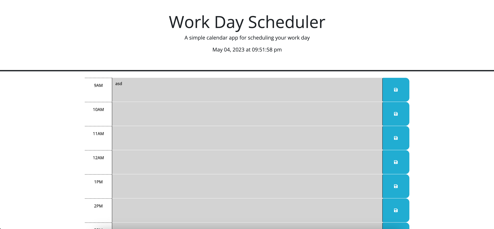

# Work_Day_Scheduler

## Description

The purpose of this project was to display the power of Java Script and api's. I used Jquary with JS and Bootstrap for the CSS. The project came together and had less code than if I didn't use API's.

## Table of Contents

- [Work\_Day\_Scheduler](#work_day_scheduler)
  - [Description](#description)
  - [Table of Contents](#table-of-contents)
  - [Installation](#installation)
  - [Usage](#usage)
  - [Credits](#credits)
  - [License](#license)

## Installation

N/A

## Usage

Now you can go on the hosted page and schedule out your day anf have it save it to your local stroage. You can go the website with this URL. 
https://jedichang99.github.io/work_day_scheduler/

## Credits

N/A

## License

Please refer to the LICENSE in the repo.
